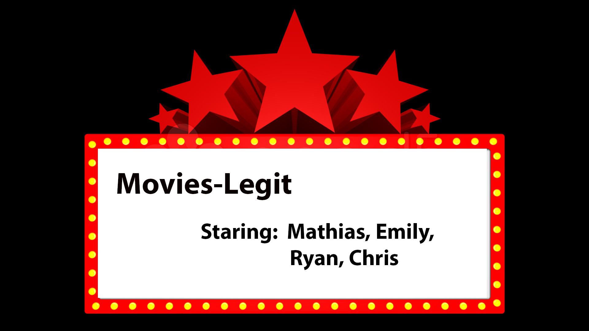
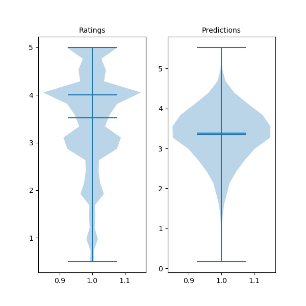
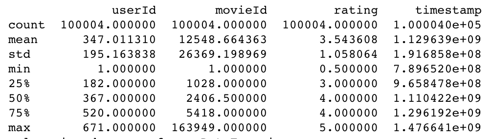

Alt Recommender Case Study

  

##### Our Goal:
Our goal is to improve the performance of Movies-Legit's recommender to increase overall revenue.
We believe we can improve our recommender using collaborative filtering. This could replace our current recommender which uses the mean of means method.
Below is a visualization for collaborative filtering.

  

[Collaborative filtering gif]( https://www.codementor.io/jadianes/building-a-recommender-with-apache-spark-python-example-app-part1-du1083qbw)

##### Our model:

Currently, Movies-Legit currently uses a Mean of Means recommender which uses an average user rating, average movie rating, and average global rating.
Our recommended model uses a more targeted average. The way it works is by using item-item collaborative filtering, in which it finds similar movies and averages their ratings.  

Our model ignores outlier movies with average ratings of 5.0 as they do not to have enough ratings to accurately reflect the preferences of the user.

##### Our data

Our dataset had 670 users and 8751 movies.
The average rating of movies was 3.5 stars.

  

##### Performance

The performance is based on RMSE score of 1.02 for the Mean of Means recommender and an RMSE score of 0.90 for our new recommender.

Our recommender shows a 12% improvement in performance over the Mean of Means recommender.

##### Sample Recommendations:

| User ID |                                                                                                      Movie Recommendation                                                                                                     |
|:-------:|:-----------------------------------------------------------------------------------------------------------------------------------------------------------------------------------------------------------------------------:|
|    50   | ’Love Is a Many-Splendored Thing (1955)’, “Rory O’Shea Was Here (Inside I’m Dancing) (2004)“, ‘Dear Zachary: A Letter to a Son About His Father (2008)’, ‘Fawlty Towers (1975-1979)’, ‘Gigantic (A Tale of Two Johns) (2002)’ |
|   333   |    'Rory O’Shea Was Here (Inside I’m Dancing) (2004)', ‘Dear Frankie (2004)’, ‘Love Is a Many-Splendored Thing (1955)’, ‘Dear Zachary: A Letter to a Son About His Father (2008)’, ‘Apollo 13: To the Edge and Back (1994)’   |
|   500   |                     ‘Angus, Thongs and Perfect Snogging (2008)’, ‘Pride and Prejudice (1995)’, ‘Dear Zachary: A Letter to a Son About His Father (2008)’, ‘Young Victoria, The (2009)’, ‘Penelope (2006)’                     |

##### Recommended Next Steps:
Our next steps would be to perform an AB test with a 95% confidence level (based on industry standards) to compare the new collaborative filtering recommender to the mean of means recommender on actual users. For the AB test, we could deploy our new recommender through our app to half of our users for testing while our current recommender will stay active for the other half. We could then measure how well our recommender is perceived through different metrics. These metrics could include how long a user stays on the site, how many times they relaunch the recommender, or even by having a single rating option after each launch asking "was this helpful".

##### Technology Use:
Used spark-ASL for our recommender. For our prototype we deployed our recommender on a flask app.

Ratings data:

  

